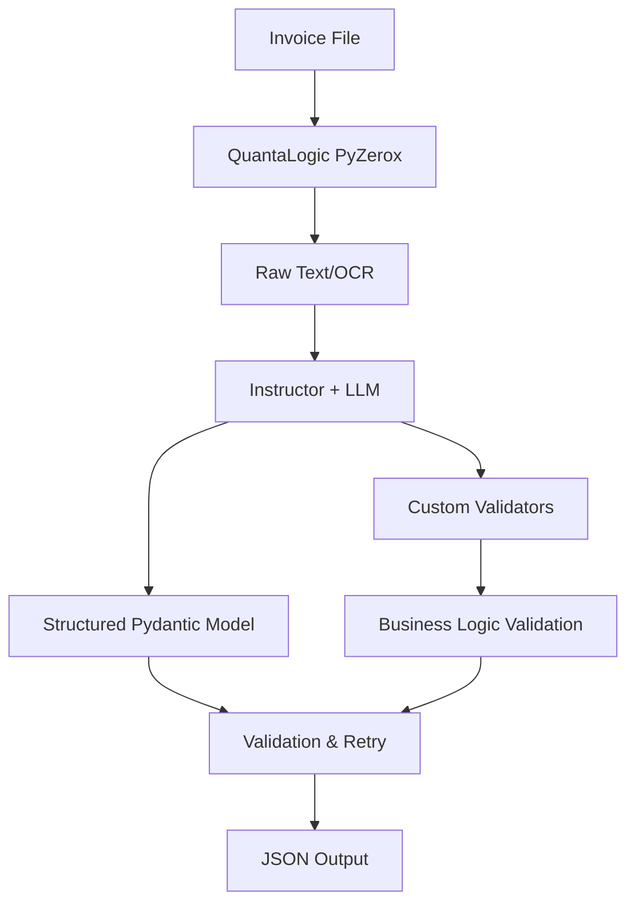

# Instructor Library Integration Guide

## Overview

The [Instructor library](https://python.useinstructor.com/) is a powerful Python library for extracting structured data from Large Language Models (LLMs) with built-in validation, retries, and type safety. This guide explains how to integrate Instructor into the invoice processing pipeline to significantly improve data extraction quality, reliability, and maintainability.

## Why Use Instructor for Invoice Processing?

### 1. **Structured Data Extraction**
- Define precise Pydantic models for invoice data structure
- Automatic validation against your schema
- Type-safe data extraction with IDE support

### 2. **Automatic Retry Logic**
- Built-in retry mechanism when validation fails
- Intelligent error handling with context
- Reduces manual error handling code

### 3. **Multi-Provider Support**
- Works with OpenAI, Anthropic, Google, and 15+ LLM providers
- Unified API across different models
- Easy to switch between providers

### 4. **Production-Ready Features**
- Streaming support for real-time processing
- Performance optimization with caching
- Comprehensive error handling and logging

## Integration Architecture



## Enhanced Data Models with Instructor

### Basic Invoice Model
```python
import instructor
from pydantic import BaseModel, Field, validator
from typing import List, Optional
from datetime import date
from decimal import Decimal

class InvoiceItem(BaseModel):
    """Invoice line item with validation."""
    description: str = Field(..., description="Item description")
    quantity: Decimal = Field(..., gt=0, description="Quantity (must be positive)")
    unit_price: Decimal = Field(..., ge=0, description="Unit price")
    total: Decimal = Field(..., ge=0, description="Line total")
    
    @validator('total')
    def validate_total(cls, v, values):
        """Validate that total = quantity * unit_price."""
        if 'quantity' in values and 'unit_price' in values:
            expected_total = values['quantity'] * values['unit_price']
            if abs(v - expected_total) > 0.01:  # Allow small rounding differences
                raise ValueError(f"Total {v} doesn't match quantity × unit_price ({expected_total})")
        return v

class InvoiceData(BaseModel):
    """Complete invoice data with business validation."""
    invoice_number: str = Field(..., description="Invoice number")
    date: date = Field(..., description="Invoice date")
    due_date: Optional[date] = Field(None, description="Due date")
    vendor_name: str = Field(..., description="Vendor/supplier name")
    customer_name: str = Field(..., description="Customer name")
    items: List[InvoiceItem] = Field(..., min_items=1, description="Invoice line items")
    subtotal: Decimal = Field(..., ge=0, description="Subtotal amount")
    tax: Decimal = Field(..., ge=0, description="Tax amount")
    total: Decimal = Field(..., ge=0, description="Total amount")
    currency: str = Field(default="USD", description="Currency code")
    
    @validator('total')
    def validate_total_amount(cls, v, values):
        """Validate that total = subtotal + tax."""
        if 'subtotal' in values and 'tax' in values:
            expected_total = values['subtotal'] + values['tax']
            if abs(v - expected_total) > 0.01:
                raise ValueError(f"Total {v} doesn't match subtotal + tax ({expected_total})")
        return v
    
    @validator('due_date')
    def validate_due_date(cls, v, values):
        """Validate that due date is after invoice date."""
        if v and 'date' in values:
            if v < values['date']:
                raise ValueError("Due date cannot be before invoice date")
        return v
```

### Advanced Model with Custom Validators
```python
from instructor import llm_validator

class EnhancedInvoiceData(BaseModel):
    """Enhanced invoice data with LLM-powered validation."""
    invoice_number: str = Field(..., description="Invoice number")
    date: date = Field(..., description="Invoice date")
    vendor_name: str = Field(
        ..., 
        description="Vendor name",
        # Custom LLM validator to ensure reasonable company names
        validator=llm_validator("Must be a valid company or business name")
    )
    items: List[InvoiceItem] = Field(..., min_items=1)
    total: Decimal = Field(..., ge=0)
    
    # Add semantic validation
    @validator('invoice_number')
    def validate_invoice_format(cls, v):
        """Validate invoice number format."""
        if not v or len(v.strip()) < 3:
            raise ValueError("Invoice number must be at least 3 characters")
        return v.strip().upper()
```

## Enhanced Processor Implementation

### Basic Instructor Integration
```python
import instructor
from openai import OpenAI
from typing import Union

class InstructorInvoiceProcessor:
    """Invoice processor using Instructor library."""
    
    def __init__(self, api_key: str, model: str = "gpt-4o"):
        """Initialize processor with Instructor-enhanced client."""
        self.client = instructor.from_openai(OpenAI(api_key=api_key))
        self.model = model
    
    def extract_invoice_data(self, text_content: str) -> InvoiceData:
        """Extract structured invoice data using Instructor."""
        try:
            return self.client.chat.completions.create(
                model=self.model,
                response_model=InvoiceData,
                messages=[
                    {
                        "role": "system",
                        "content": """You are an expert invoice data extractor. 
                        Extract all relevant information from the provided invoice text.
                        Be precise with numbers and dates. If information is unclear or missing,
                        use reasonable defaults or leave optional fields empty."""
                    },
                    {
                        "role": "user",
                        "content": f"Extract structured data from this invoice:\n\n{text_content}"
                    }
                ],
                max_retries=3,  # Automatic retry on validation failure
            )
        except Exception as e:
            raise ValueError(f"Failed to extract invoice data: {str(e)}")

    def extract_with_confidence(self, text_content: str) -> tuple[InvoiceData, float]:
        """Extract invoice data with confidence scoring."""
        # Use create_with_completion to get the raw response
        invoice_data, completion = self.client.chat.completions.create_with_completion(
            model=self.model,
            response_model=InvoiceData,
            messages=[
                {
                    "role": "system",
                    "content": """Extract invoice data and provide confidence in your extraction.
                    Focus on accuracy over completeness."""
                },
                {
                    "role": "user",
                    "content": f"Extract data from: {text_content}"
                }
            ]
        )
        
        # Calculate confidence based on completion metadata
        confidence = self._calculate_confidence(completion)
        return invoice_data, confidence
    
    def _calculate_confidence(self, completion) -> float:
        """Calculate confidence score based on completion metadata."""
        # Simple confidence calculation based on response characteristics
        # In practice, you might use more sophisticated methods
        if completion.usage and completion.usage.completion_tokens:
            # More detailed responses often indicate higher confidence
            return min(1.0, completion.usage.completion_tokens / 500)
        return 0.8  # Default confidence
```

### Multi-Provider Implementation
```python
class UniversalInvoiceProcessor:
    """Universal invoice processor supporting multiple LLM providers."""
    
    def __init__(self, provider: str = "openai", model: str = None):
        """Initialize with any supported provider."""
        self.provider = provider
        self.model = model or self._get_default_model(provider)
        self.client = self._create_client()
    
    def _get_default_model(self, provider: str) -> str:
        """Get default model for provider."""
        defaults = {
            "openai": "gpt-4o",
            "anthropic": "claude-3-5-sonnet-20241022",
            "google": "gemini-2.0-flash-exp",
            "ollama": "llama3"
        }
        return defaults.get(provider, "gpt-4o")
    
    def _create_client(self):
        """Create Instructor client for the specified provider."""
        if self.provider == "openai":
            return instructor.from_openai(OpenAI())
        elif self.provider == "anthropic":
            return instructor.from_anthropic(Anthropic())
        elif self.provider == "google":
            return instructor.from_google(GoogleGenerativeAI())
        elif self.provider == "ollama":
            return instructor.from_ollama(Ollama())
        else:
            raise ValueError(f"Unsupported provider: {self.provider}")
    
    def extract_invoice_data(self, text_content: str) -> InvoiceData:
        """Extract data using the configured provider."""
        return self.client.chat.completions.create(
            model=self.model,
            response_model=InvoiceData,
            messages=[
                {
                    "role": "system",
                    "content": "Extract structured invoice data accurately."
                },
                {
                    "role": "user",
                    "content": f"Invoice text: {text_content}"
                }
            ]
        )
```

## Advanced Features Integration

### Streaming Processing
```python
class StreamingInvoiceProcessor:
    """Process invoices with streaming for real-time updates."""
    
    def __init__(self, client):
        self.client = client
    
    def extract_with_streaming(self, text_content: str):
        """Stream partial invoice data as it's extracted."""
        # Stream partial results
        for partial_invoice in self.client.chat.completions.create_partial(
            model="gpt-4o",
            response_model=InvoiceData,
            messages=[
                {"role": "user", "content": f"Extract invoice data: {text_content}"}
            ]
        ):
            yield partial_invoice
    
    def extract_multiple_invoices(self, text_contents: List[str]):
        """Extract multiple invoices using streaming."""
        for invoice_data in self.client.chat.completions.create_iterable(
            model="gpt-4o",
            response_model=InvoiceData,
            messages=[
                {"role": "user", "content": f"Extract data from invoices: {text_contents}"}
            ]
        ):
            yield invoice_data
```

### Custom Validation and Retry Logic
```python
from instructor import llm_validator

class ValidatedInvoiceData(BaseModel):
    """Invoice data with custom LLM validation."""
    
    invoice_number: str = Field(
        ...,
        description="Invoice number",
        validator=llm_validator("Must be a valid invoice number format")
    )
    
    vendor_name: str = Field(
        ...,
        description="Vendor name",
        validator=llm_validator("Must be a legitimate business name")
    )
    
    total: Decimal = Field(
        ...,
        ge=0,
        description="Total amount",
        validator=llm_validator("Must be a reasonable amount for an invoice")
    )
    
    @validator('total')
    def validate_reasonable_amount(cls, v):
        """Validate that the total is reasonable."""
        if v > 1000000:  # $1M threshold
            raise ValueError("Total amount seems unreasonably high")
        return v
```

## Enhanced Assignment Integration

### Updated CLI with Instructor
```python
import click
import instructor
from openai import OpenAI
from .models import InvoiceData
from .processor import InstructorInvoiceProcessor

@click.command()
@click.argument('invoice_file', type=click.Path(exists=True))
@click.option('--output', '-o', type=click.Path(), help='Output JSON file')
@click.option('--provider', default='openai', help='LLM provider (openai, anthropic, google)')
@click.option('--model', help='Specific model to use')
@click.option('--stream', is_flag=True, help='Enable streaming output')
@click.option('--validate', is_flag=True, help='Enable enhanced validation')
def extract_invoice(invoice_file, output, provider, model, stream, validate):
    """Extract structured data from invoice files using Instructor."""
    try:
        # Initialize processor
        processor = InstructorInvoiceProcessor(
            provider=provider,
            model=model,
            streaming=stream,
            enhanced_validation=validate
        )
        
        # Process invoice
        if stream:
            click.echo("Processing with streaming...")
            for partial_data in processor.extract_with_streaming(invoice_file):
                click.echo(f"Partial data: {partial_data.invoice_number or 'Processing...'}")
        else:
            result = processor.extract_invoice_data(invoice_file)
            
            # Output results
            if output:
                with open(output, 'w') as f:
                    f.write(result.model_dump_json(indent=2))
                click.echo(f"Results saved to {output}")
            else:
                click.echo(result.model_dump_json(indent=2))
                
    except Exception as e:
        click.echo(f"Error: {str(e)}", err=True)
        raise click.Abort()
```

### Enhanced Error Handling
```python
from instructor import ValidationError

class RobustInvoiceProcessor:
    """Invoice processor with comprehensive error handling."""
    
    def __init__(self, client):
        self.client = client
        self.max_retries = 3
    
    def extract_with_fallback(self, text_content: str) -> InvoiceData:
        """Extract data with fallback strategies."""
        strategies = [
            self._extract_detailed,
            self._extract_basic,
            self._extract_minimal
        ]
        
        for i, strategy in enumerate(strategies):
            try:
                return strategy(text_content)
            except ValidationError as e:
                if i == len(strategies) - 1:
                    raise ValueError(f"All extraction strategies failed: {e}")
                continue
    
    def _extract_detailed(self, text_content: str) -> InvoiceData:
        """Try detailed extraction with full validation."""
        return self.client.chat.completions.create(
            model="gpt-4o",
            response_model=EnhancedInvoiceData,
            messages=[
                {"role": "system", "content": "Extract complete invoice data with high accuracy."},
                {"role": "user", "content": text_content}
            ]
        )
    
    def _extract_basic(self, text_content: str) -> InvoiceData:
        """Try basic extraction with relaxed validation."""
        return self.client.chat.completions.create(
            model="gpt-4o",
            response_model=InvoiceData,
            messages=[
                {"role": "system", "content": "Extract essential invoice information."},
                {"role": "user", "content": text_content}
            ]
        )
    
    def _extract_minimal(self, text_content: str) -> InvoiceData:
        """Last resort: minimal extraction."""
        # Use a simplified model for minimal extraction
        return self.client.chat.completions.create(
            model="gpt-4o",
            response_model=MinimalInvoiceData,
            messages=[
                {"role": "system", "content": "Extract only the most basic invoice information."},
                {"role": "user", "content": text_content}
            ]
        )
```

## Performance Optimization

### Caching and Batch Processing
```python
from instructor import patch
import hashlib

class OptimizedInvoiceProcessor:
    """Optimized processor with caching and batch processing."""
    
    def __init__(self):
        self.cache = {}
        self.client = instructor.from_openai(OpenAI())
    
    def extract_with_cache(self, text_content: str) -> InvoiceData:
        """Extract with response caching."""
        # Create cache key
        cache_key = hashlib.md5(text_content.encode()).hexdigest()
        
        if cache_key in self.cache:
            return self.cache[cache_key]
        
        # Extract data
        result = self.client.chat.completions.create(
            model="gpt-4o",
            response_model=InvoiceData,
            messages=[
                {"role": "user", "content": text_content}
            ]
        )
        
        # Cache result
        self.cache[cache_key] = result
        return result
    
    def batch_extract(self, text_contents: List[str]) -> List[InvoiceData]:
        """Process multiple invoices in batch."""
        results = []
        
        # Use OpenAI's batch API for cost optimization
        for text in text_contents:
            result = self.extract_with_cache(text)
            results.append(result)
        
        return results
```

## Testing with Instructor

### Unit Tests
```python
import pytest
from unittest.mock import Mock
from instructor import ValidationError

def test_invoice_extraction_success():
    """Test successful invoice extraction."""
    processor = InstructorInvoiceProcessor()
    
    # Mock successful extraction
    mock_result = InvoiceData(
        invoice_number="INV-001",
        date="2024-01-15",
        vendor_name="Test Vendor",
        total=100.00,
        items=[
            InvoiceItem(
                description="Test Item",
                quantity=1,
                unit_price=100.00,
                total=100.00
            )
        ]
    )
    
    processor.client.chat.completions.create = Mock(return_value=mock_result)
    
    result = processor.extract_invoice_data("test invoice text")
    
    assert result.invoice_number == "INV-001"
    assert result.total == 100.00
    assert len(result.items) == 1

def test_invoice_extraction_validation_error():
    """Test handling of validation errors."""
    processor = InstructorInvoiceProcessor()
    
    # Mock validation error
    processor.client.chat.completions.create = Mock(
        side_effect=ValidationError("Invalid data format")
    )
    
    with pytest.raises(ValueError, match="Failed to extract invoice data"):
        processor.extract_invoice_data("invalid invoice text")
```

### Integration Tests
```python
def test_end_to_end_extraction():
    """Test complete extraction pipeline."""
    # Test with real invoice text
    invoice_text = """
    INVOICE #INV-2024-001
    Date: January 15, 2024
    
    Bill To: John Doe
    123 Main St
    
    From: ABC Company
    456 Business Ave
    
    Item: Consulting Services
    Quantity: 10 hours
    Rate: $150/hour
    Total: $1,500.00
    
    Subtotal: $1,500.00
    Tax: $120.00
    Total: $1,620.00
    """
    
    processor = InstructorInvoiceProcessor()
    result = processor.extract_invoice_data(invoice_text)
    
    assert result.invoice_number == "INV-2024-001"
    assert result.total == 1620.00
    assert len(result.items) == 1
    assert result.items[0].description == "Consulting Services"
```

## Assignment Enhancements

### 1. **Replace Basic Parsing with Instructor**
Update the assignment to use Instructor instead of basic text parsing:

```python
# OLD: Basic text parsing
def parse_invoice_text(text):
    # Manual regex and string manipulation
    pass

# NEW: Instructor-based extraction
def extract_invoice_data(text):
    client = instructor.from_openai(OpenAI())
    return client.chat.completions.create(
        model="gpt-4o",
        response_model=InvoiceData,
        messages=[{"role": "user", "content": text}]
    )
```

### 2. **Add Validation Challenges**
Include validation scenarios in the assignment:

```python
# Challenge: Handle invalid data
def test_extraction_with_invalid_data():
    """Students learn to handle validation errors."""
    try:
        result = extract_invoice_data("not an invoice")
    except ValidationError as e:
        print(f"Validation failed: {e}")
```

### 3. **Multi-Provider Support**
Teach students to work with different LLM providers:

```python
# Challenge: Support multiple providers
@click.option('--provider', type=click.Choice(['openai', 'anthropic', 'google']))
def extract_invoice(provider):
    processor = UniversalInvoiceProcessor(provider=provider)
    return processor.extract_invoice_data(text)
```

### 4. **Streaming Implementation**
Add real-time processing capabilities:

```python
# Challenge: Implement streaming
def stream_invoice_extraction(text):
    for partial_data in processor.extract_with_streaming(text):
        print(f"Processing: {partial_data.invoice_number or 'Working...'}")
```

## Benefits Summary

### For Students
- **Learn Modern Patterns**: Industry-standard structured data extraction
- **Type Safety**: Full IDE support with autocomplete and type checking
- **Error Handling**: Automatic retry and validation patterns
- **Production Ready**: Skills directly applicable to real-world projects

### For the Application
- **Higher Accuracy**: Structured validation ensures data quality
- **Better Reliability**: Automatic retries and error handling
- **Maintainability**: Clear data models and separation of concerns
- **Scalability**: Support for multiple providers and batch processing

## Migration Path

### Phase 1: Basic Integration
1. Replace basic text parsing with Instructor
2. Add Pydantic models for data validation
3. Implement basic error handling

### Phase 2: Enhanced Features
1. Add multi-provider support
2. Implement streaming capabilities
3. Add custom validators

### Phase 3: Production Features
1. Add caching and performance optimization
2. Implement batch processing
3. Add comprehensive logging and monitoring

## Conclusion

Integrating the Instructor library transforms the invoice processing assignment from a basic text parsing exercise into a comprehensive, production-ready application that teaches modern AI development patterns. Students learn industry-standard practices while building a more robust and maintainable solution.

The library's automatic validation, retry logic, and multi-provider support make it an ideal choice for document processing applications, providing a solid foundation for real-world AI-powered systems.

---

## Cross-References

- [Project Specification](./spec-invoice.md) - Core requirements and architecture
- [Step-by-Step Assignment](./preparation-work/step-by-step-assignment.md) - Detailed implementation guide
- [QuantaLogic PyZerox Usage](./using-quantalogic-pyzerox.md) - OCR and document processing
- [FastAPI Setup Guide](./setup-fastapi-project.md) - Building the API layer
- [Environment Management](./managing-env-files.md) - Configuration and deployment
- [Project README](../README.md) - Overview and getting started

## External Resources

- [Instructor Documentation](https://python.useinstructor.com/) - Official documentation
- [Instructor GitHub Repository](https://github.com/jxnl/instructor) - Source code and examples
- [Pydantic Documentation](https://docs.pydantic.dev/) - Data validation library
- [OpenAI API Documentation](https://platform.openai.com/docs) - LLM API reference
