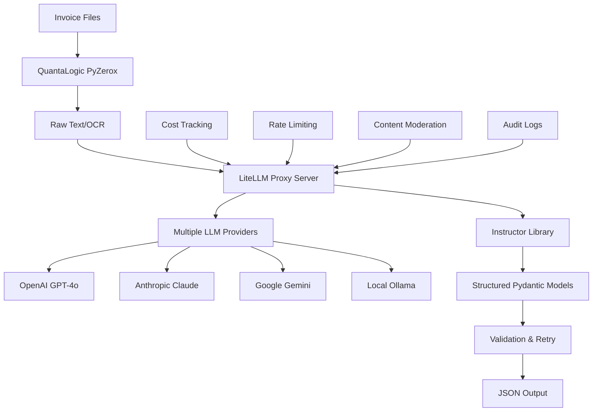

# LiteLLM Integration Guide: Universal LLM Gateway for Invoice Processing

## Overview

[LiteLLM](https://litellm.ai/) is a powerful Python library and proxy server that provides a unified interface to 100+ Large Language Models (LLMs) using the OpenAI input/output format. When combined with the Instructor library, LiteLLM creates a robust, scalable, and cost-effective solution for invoice processing that works across multiple AI providers with comprehensive monitoring and management capabilities.

## What is LiteLLM?

LiteLLM serves as a **universal LLM gateway** that:

- **Translates inputs** to any provider's completion, embedding, and image generation endpoints
- **Normalizes outputs** so text responses are always available at `['choices'][0]['message']['content']`
- **Provides retry/fallback logic** across multiple deployments (e.g., Azure/OpenAI)
- **Tracks spend and usage** with built-in cost monitoring and budgets
- **Offers enterprise features** like rate limiting, guardrails, and access control

### Key Statistics (2024-2025)
- **1B+ requests served** across all deployments
- **100M+ Docker pulls** demonstrating widespread adoption
- **425+ contributors** and active open-source community
- **Used by Netflix, Lemonade, RocketMoney** and other major companies

## Why Use LiteLLM with Instructor for Invoice Processing?

### 1. **Multi-Provider Flexibility**
```python
# Switch between providers with zero code changes
processor_openai = InvoiceProcessor(provider="openai", model="gpt-4o")
processor_anthropic = InvoiceProcessor(provider="anthropic", model="claude-3-5-sonnet")
processor_google = InvoiceProcessor(provider="google", model="gemini-2.0-flash")
processor_local = InvoiceProcessor(provider="ollama", model="llama3")
```

### 2. **Cost Optimization**
- **Automatic cost tracking** across all providers
- **Smart fallback logic** to cheaper models when primary fails
- **Budget controls** per team, user, or project
- **Batch processing** for cost-effective bulk operations

### 3. **Enterprise-Ready Features**
- **Rate limiting** to prevent API quota exhaustion
- **Content moderation** with multiple guardrail systems
- **Audit logging** for compliance and monitoring
- **SSO integration** and role-based access control

### 4. **Production Reliability**
- **Automatic retries** with exponential backoff
- **Load balancing** across multiple API keys/endpoints
- **Health monitoring** and provider outage detection
- **Response caching** for improved performance

## Integration Architecture



## Core Implementation

### Basic LiteLLM + Instructor Integration

```python
import litellm
import instructor
from pydantic import BaseModel, Field
from typing import List, Optional
from datetime import date
from decimal import Decimal

# Configure LiteLLM with multiple providers
litellm.set_verbose = True  # Enable detailed logging
litellm.success_callback = ["lunary", "langfuse"]  # Enable observability

class InvoiceData(BaseModel):
    """Invoice data model for structured extraction."""
    invoice_number: str = Field(..., description="Invoice number")
    date: date = Field(..., description="Invoice date")
    vendor_name: str = Field(..., description="Vendor/supplier name")
    total: Decimal = Field(..., ge=0, description="Total amount")
    items: List[dict] = Field(..., description="Invoice line items")

class LiteLLMInvoiceProcessor:
    """Invoice processor using LiteLLM + Instructor."""
    
    def __init__(self, providers: List[str] = None):
        """Initialize with fallback providers."""
        self.providers = providers or ["openai/gpt-4o", "anthropic/claude-3-5-sonnet", "google/gemini-pro"]
        self.current_provider = 0
    
    def extract_invoice_data(self, text_content: str) -> InvoiceData:
        """Extract data with automatic provider fallback."""
        for i, provider in enumerate(self.providers):
            try:
                # Use LiteLLM's unified completion interface
                response = litellm.completion(
                    model=provider,
                    messages=[
                        {
                            "role": "system",
                            "content": "Extract structured invoice data. Be precise with numbers and dates."
                        },
                        {
                            "role": "user", 
                            "content": f"Extract data from this invoice:\n\n{text_content}"
                        }
                    ],
                    response_format={"type": "json_object"},  # Ensure JSON output
                    temperature=0.1,
                    max_retries=3
                )
                
                # Parse with Pydantic for validation
                content = response.choices[0].message.content
                invoice_data = InvoiceData.model_validate_json(content)
                
                # Track successful provider for future requests
                self.current_provider = i
                return invoice_data
                
            except Exception as e:
                print(f"Provider {provider} failed: {e}")
                if i == len(self.providers) - 1:
                    raise ValueError(f"All providers failed. Last error: {e}")
                continue
        
        raise ValueError("No providers available")
```

### Advanced Integration with LiteLLM Proxy

```python
import openai
import instructor
from typing import Union, List

class ProxyInvoiceProcessor:
    """Invoice processor using LiteLLM Proxy Server."""
    
    def __init__(self, proxy_url: str = "http://localhost:4000", api_key: str = "sk-1234"):
        """Initialize with LiteLLM proxy."""
        # Configure OpenAI client to use LiteLLM proxy
        self.client = instructor.from_openai(
            openai.OpenAI(
                api_key=api_key,
                base_url=proxy_url
            )
        )
    
    def extract_with_cost_tracking(self, text_content: str, user_id: str = None, team_id: str = None) -> tuple[InvoiceData, dict]:
        """Extract data with detailed cost tracking."""
        response = self.client.chat.completions.create_with_completion(
            model="gpt-4o",  # LiteLLM proxy routes to configured provider
            response_model=InvoiceData,
            messages=[
                {"role": "user", "content": f"Extract invoice data: {text_content}"}
            ],
            user=user_id,  # Track by user for billing
            extra_body={
                "metadata": {
                    "tags": ["invoice-processing", f"team:{team_id}"],
                    "generation_name": "invoice_extraction"
                }
            }
        )
        
        invoice_data, completion = response
        
        # Extract cost information from response headers
        cost_info = {
            "model_used": completion.model,
            "prompt_tokens": completion.usage.prompt_tokens,
            "completion_tokens": completion.usage.completion_tokens,
            "total_tokens": completion.usage.total_tokens,
            # LiteLLM adds cost tracking headers
            "estimated_cost": getattr(completion, 'response_cost', 0)
        }
        
        return invoice_data, cost_info
```

## LiteLLM Proxy Server Configuration

### Basic Configuration (`litellm_config.yaml`)

```yaml
# LiteLLM Proxy Configuration for Invoice Processing
model_list:
  # Primary OpenAI models
  - model_name: gpt-4o
    litellm_params:
      model: openai/gpt-4o
      api_key: os.environ/OPENAI_API_KEY
      max_tokens: 4000
      temperature: 0.1
  
  # Fallback to Anthropic
  - model_name: claude-3-5-sonnet
    litellm_params:
      model: anthropic/claude-3-5-sonnet-20241022
      api_key: os.environ/ANTHROPIC_API_KEY
      max_tokens: 4000
      temperature: 0.1
  
  # Cost-effective option
  - model_name: gpt-4o-mini
    litellm_params:
      model: openai/gpt-4o-mini
      api_key: os.environ/OPENAI_API_KEY
      max_tokens: 2000
      temperature: 0.1
  
  # Local processing option
  - model_name: llama3-local
    litellm_params:
      model: ollama/llama3
      api_base: http://localhost:11434

# General settings
general_settings:
  master_key: sk-invoice-processor-2025
  max_request_size_mb: 10
  max_response_size_mb: 5
  
  # Database for tracking
  database_url: os.environ/DATABASE_URL
  
  # Cost tracking
  track_spend: true
  
  # Rate limiting
  default_max_requests_per_minute: 100
  default_max_tokens_per_minute: 10000

# Enterprise features
litellm_settings:
  # Enable callbacks for monitoring
  success_callback: ["langfuse", "lunary"]
  failure_callback: ["slack"]
  
  # Content moderation
  callbacks: ["hide_secrets", "llamaguard_moderations"]
  
  # Caching for performance
  cache: true
  cache_type: "redis"
  redis_host: "localhost"
  redis_port: 6379
  
  # Observability
  enable_prometheus_metrics: true

# Router configuration for load balancing
router_settings:
  routing_strategy: "usage-based-routing"
  model_group_alias:
    invoice-processing:
      - gpt-4o
      - claude-3-5-sonnet
      - gpt-4o-mini
  
  # Fallback logic
  enable_fallbacks: true
  fallback_models:
    gpt-4o: ["claude-3-5-sonnet", "gpt-4o-mini"]
    claude-3-5-sonnet: ["gpt-4o", "gpt-4o-mini"]
```

### Enterprise Features Configuration

```yaml
# Additional enterprise configuration
general_settings:
  # Security
  allowed_ips: ["192.168.1.0/24", "10.0.0.0/8"]
  public_routes: ["/health"]
  admin_only_routes: ["/spend", "/users", "/teams"]
  
  # Authentication
  enforced_params: ["user", "metadata.team_id"]
  
  # Budget controls
  max_budget_per_team: 1000.0  # $1000 per team per month
  budget_alert_threshold: 0.8  # Alert at 80% budget usage

# Team-specific configurations
teams:
  - team_id: "finance-team"
    models: ["gpt-4o", "claude-3-5-sonnet"]
    max_budget: 500.0
    rate_limit: 200  # requests per minute
    
  - team_id: "processing-team"
    models: ["gpt-4o-mini", "llama3-local"]
    max_budget: 200.0
    rate_limit: 500

# Guardrails configuration
guardrails:
  hide_secrets: true
  banned_keywords: ["password", "secret", "api_key"]
  enable_content_moderation: true
  moderation_confidence_threshold: 0.8
```

## Advanced Use Cases

### 1. Smart Cost Optimization

```python
class CostOptimizedProcessor:
    """Invoice processor with intelligent cost optimization."""
    
    def __init__(self, proxy_url: str, api_key: str):
        self.client = instructor.from_openai(
            openai.OpenAI(api_key=api_key, base_url=proxy_url)
        )
        self.cost_thresholds = {
            "simple": 0.001,    # Use cheaper model for simple invoices
            "complex": 0.01,    # Use premium model for complex invoices
            "bulk": 0.005       # Balanced cost for bulk processing
        }
    
    def extract_with_cost_optimization(self, text_content: str, complexity: str = "simple") -> InvoiceData:
        """Extract data using cost-optimized model selection."""
        
        # Select model based on complexity and cost thresholds
        model_map = {
            "simple": "gpt-4o-mini",      # Cheapest option
            "complex": "gpt-4o",          # Best performance
            "bulk": "claude-3-5-sonnet"   # Balanced option
        }
        
        model = model_map.get(complexity, "gpt-4o-mini")
        
        try:
            return self.client.chat.completions.create(
                model=model,
                response_model=InvoiceData,
                messages=[
                    {"role": "user", "content": f"Extract invoice data: {text_content}"}
                ],
                extra_body={
                    "metadata": {
                        "complexity": complexity,
                        "cost_optimization": True
                    }
                }
            )
        except Exception as e:
            # Fallback to premium model if cheaper option fails
            if model != "gpt-4o":
                return self.client.chat.completions.create(
                    model="gpt-4o",
                    response_model=InvoiceData,
                    messages=[
                        {"role": "user", "content": f"Extract invoice data: {text_content}"}
                    ]
                )
            raise e
```

### 2. Batch Processing with Load Balancing

```python
import asyncio
from concurrent.futures import ThreadPoolExecutor
from typing import List, Tuple

class BatchInvoiceProcessor:
    """Process multiple invoices with load balancing."""
    
    def __init__(self, proxy_url: str, api_key: str, max_workers: int = 10):
        self.client = instructor.from_openai(
            openai.OpenAI(api_key=api_key, base_url=proxy_url)
        )
        self.max_workers = max_workers
    
    async def process_batch(self, invoices: List[Tuple[str, str]]) -> List[InvoiceData]:
        """Process multiple invoices concurrently."""
        
        async def process_single(invoice_id: str, text_content: str) -> Tuple[str, InvoiceData]:
            """Process a single invoice."""
            try:
                result = self.client.chat.completions.create(
                    model="invoice-processing",  # Uses router load balancing
                    response_model=InvoiceData,
                    messages=[
                        {"role": "user", "content": f"Extract invoice data: {text_content}"}
                    ],
                    extra_body={
                        "metadata": {
                            "invoice_id": invoice_id,
                            "batch_processing": True,
                            "timestamp": datetime.now().isoformat()
                        }
                    }
                )
                return invoice_id, result
            except Exception as e:
                print(f"Failed to process invoice {invoice_id}: {e}")
                return invoice_id, None
        
        # Process invoices concurrently
        tasks = [process_single(inv_id, content) for inv_id, content in invoices]
        results = await asyncio.gather(*tasks, return_exceptions=True)
        
        # Filter successful results
        successful_results = [result[1] for result in results if result[1] is not None]
        return successful_results
```

### 3. Real-time Monitoring and Alerting

```python
import requests
from datetime import datetime, timedelta

class InvoiceProcessorMonitor:
    """Monitor invoice processing costs and performance."""
    
    def __init__(self, proxy_url: str, api_key: str):
        self.proxy_url = proxy_url
        self.api_key = api_key
        self.headers = {"Authorization": f"Bearer {api_key}"}
    
    def get_spend_report(self, days: int = 7) -> dict:
        """Get spending report for last N days."""
        end_date = datetime.now()
        start_date = end_date - timedelta(days=days)
        
        response = requests.get(
            f"{self.proxy_url}/spend/report",
            headers=self.headers,
            params={
                "start_date": start_date.isoformat(),
                "end_date": end_date.isoformat(),
                "group_by": "team"
            }
        )
        
        return response.json() if response.status_code == 200 else {}
    
    def get_performance_metrics(self) -> dict:
        """Get performance metrics from LiteLLM."""
        try:
            response = requests.get(
                f"{self.proxy_url}/metrics",  # Prometheus endpoint
                headers=self.headers
            )
            return self._parse_prometheus_metrics(response.text)
        except Exception as e:
            print(f"Failed to get metrics: {e}")
            return {}
    
    def _parse_prometheus_metrics(self, metrics_text: str) -> dict:
        """Parse Prometheus metrics for key performance indicators."""
        metrics = {}
        
        for line in metrics_text.split('\n'):
            if 'litellm_request_total' in line:
                # Parse request counts by model/provider
                pass
            elif 'litellm_request_latency' in line:
                # Parse latency metrics
                pass
            elif 'litellm_cost_total' in line:
                # Parse cost metrics
                pass
        
        return metrics
    
    def check_budget_alerts(self, threshold: float = 0.8) -> List[dict]:
        """Check for teams approaching budget limits."""
        alerts = []
        spend_data = self.get_spend_report(days=30)  # Monthly budget check
        
        for team_data in spend_data.get("teams", []):
            team_name = team_data.get("team_name")
            current_spend = team_data.get("total_spend", 0)
            budget_limit = team_data.get("budget_limit", float('inf'))
            
            if current_spend / budget_limit > threshold:
                alerts.append({
                    "team": team_name,
                    "current_spend": current_spend,
                    "budget_limit": budget_limit,
                    "percentage_used": (current_spend / budget_limit) * 100,
                    "alert_type": "budget_threshold"
                })
        
        return alerts
```

## Deployment Options

### 1. Docker Deployment

```dockerfile
# Dockerfile for LiteLLM Proxy
FROM ghcr.io/berriai/litellm:main-latest

# Copy configuration
COPY litellm_config.yaml /app/config.yaml

# Set environment variables
ENV LITELLM_MASTER_KEY=sk-invoice-processor-2025
ENV DATABASE_URL=postgresql://user:pass@db:5432/litellm

# Expose port
EXPOSE 4000

# Start proxy
CMD ["litellm", "--config", "/app/config.yaml", "--port", "4000"]
```

```yaml
# docker-compose.yml
version: '3.8'

services:
  litellm-proxy:
    build: .
    ports:
      - "4000:4000"
    environment:
      - OPENAI_API_KEY=${OPENAI_API_KEY}
      - ANTHROPIC_API_KEY=${ANTHROPIC_API_KEY}
      - DATABASE_URL=postgresql://postgres:password@db:5432/litellm
    depends_on:
      - db
      - redis
    volumes:
      - ./logs:/app/logs

  db:
    image: postgres:15
    environment:
      POSTGRES_DB: litellm
      POSTGRES_USER: postgres
      POSTGRES_PASSWORD: password
    ports:
      - "5432:5432"
    volumes:
      - postgres_data:/var/lib/postgresql/data

  redis:
    image: redis:7-alpine
    ports:
      - "6379:6379"
    volumes:
      - redis_data:/data

volumes:
  postgres_data:
  redis_data:
```

### 2. Kubernetes Deployment

```yaml
# k8s-deployment.yaml
apiVersion: apps/v1
kind: Deployment
metadata:
  name: litellm-proxy
  labels:
    app: litellm-proxy
spec:
  replicas: 3
  selector:
    matchLabels:
      app: litellm-proxy
  template:
    metadata:
      labels:
        app: litellm-proxy
    spec:
      containers:
      - name: litellm-proxy
        image: ghcr.io/berriai/litellm:main-latest
        ports:
        - containerPort: 4000
        env:
        - name: LITELLM_MASTER_KEY
          valueFrom:
            secretKeyRef:
              name: litellm-secrets
              key: master-key
        - name: DATABASE_URL
          valueFrom:
            secretKeyRef:
              name: litellm-secrets
              key: database-url
        volumeMounts:
        - name: config
          mountPath: /app/config.yaml
          subPath: config.yaml
        livenessProbe:
          httpGet:
            path: /health
            port: 4000
          initialDelaySeconds: 30
          periodSeconds: 10
        resources:
          requests:
            memory: "512Mi"
            cpu: "250m"
          limits:
            memory: "1Gi"
            cpu: "500m"
      volumes:
      - name: config
        configMap:
          name: litellm-config

---
apiVersion: v1
kind: Service
metadata:
  name: litellm-proxy-service
spec:
  selector:
    app: litellm-proxy
  ports:
  - protocol: TCP
    port: 4000
    targetPort: 4000
  type: LoadBalancer
```

## Enhanced Assignment Integration

### Updated Assignment with LiteLLM Options

Add these sections to the step-by-step assignment:

#### Optional Enhancement: LiteLLM Multi-Provider Support

```python
# Add to pyproject.toml dependencies
litellm>=1.0.0

# Enhanced processor with LiteLLM
class MultiProviderInvoiceProcessor:
    """Invoice processor with multiple LLM providers."""
    
    def __init__(self, providers: List[str] = None):
        self.providers = providers or [
            "openai/gpt-4o",
            "anthropic/claude-3-5-sonnet", 
            "google/gemini-pro"
        ]
    
    def extract_invoice_data(self, text_content: str) -> InvoiceData:
        """Extract data with automatic provider fallback."""
        for provider in self.providers:
            try:
                response = litellm.completion(
                    model=provider,
                    messages=[
                        {"role": "user", "content": f"Extract invoice data: {text_content}"}
                    ],
                    temperature=0.1
                )
                
                # Parse and validate with Pydantic
                content = response.choices[0].message.content
                return InvoiceData.model_validate_json(content)
                
            except Exception as e:
                print(f"Provider {provider} failed: {e}")
                continue
        
        raise ValueError("All providers failed")
```

#### Enhanced CLI with LiteLLM Integration

```python
@click.command()
@click.argument('invoice_file', type=click.Path(exists=True))
@click.option('--provider', multiple=True, help='LLM providers to use (can specify multiple)')
@click.option('--use-proxy', is_flag=True, help='Use LiteLLM proxy server')
@click.option('--proxy-url', default='http://localhost:4000', help='LiteLLM proxy URL')
@click.option('--track-cost', is_flag=True, help='Enable cost tracking')
@click.option('--team-id', help='Team ID for cost allocation')
def extract_invoice(invoice_file, provider, use_proxy, proxy_url, track_cost, team_id):
    """Enhanced CLI with LiteLLM multi-provider support."""
    
    if use_proxy:
        processor = ProxyInvoiceProcessor(proxy_url=proxy_url)
    else:
        providers = list(provider) if provider else ["openai/gpt-4o"]
        processor = MultiProviderInvoiceProcessor(providers=providers)
    
    # Process with cost tracking if enabled
    if track_cost and hasattr(processor, 'extract_with_cost_tracking'):
        result, cost_info = processor.extract_with_cost_tracking(
            text_content, 
            team_id=team_id
        )
        click.echo(f"Processing cost: ${cost_info.get('estimated_cost', 0):.4f}")
    else:
        result = processor.extract_invoice_data(text_content)
    
    click.echo(result.model_dump_json(indent=2))
```

## Benefits Summary

### For Development Teams

1. **Reduced Vendor Lock-in**: Easy switching between LLM providers
2. **Cost Control**: Automatic tracking and budget management
3. **Reliability**: Built-in fallbacks and retry logic
4. **Observability**: Comprehensive monitoring and alerting
5. **Scalability**: Load balancing and rate limiting

### For Enterprise Deployment

1. **Security**: Content moderation, secret detection, access controls
2. **Compliance**: Audit logs, data retention policies, GDPR support
3. **Cost Management**: Detailed spend reports, budget alerts, team allocation
4. **Performance**: Caching, load balancing, health monitoring
5. **Integration**: Works with existing authentication and monitoring systems

### For Invoice Processing Specifically

1. **Multi-modal Support**: Works with PDF, image, and text inputs
2. **Cost Optimization**: Smart routing based on document complexity
3. **Batch Processing**: Efficient handling of large invoice volumes
4. **Quality Assurance**: Multiple providers for validation and comparison
5. **Audit Trail**: Complete tracking of processing costs and performance

## Migration from Basic to LiteLLM

### Phase 1: Basic Integration
1. Replace direct OpenAI calls with LiteLLM completion
2. Add basic provider fallback logic
3. Enable cost tracking

### Phase 2: Proxy Server
1. Deploy LiteLLM proxy server
2. Configure multiple providers and routing
3. Add monitoring and alerting

### Phase 3: Enterprise Features
1. Implement team-based cost allocation
2. Add content moderation and guardrails
3. Set up comprehensive monitoring dashboard

## Conclusion

LiteLLM provides a production-ready foundation for multi-provider LLM access with comprehensive monitoring, cost control, and enterprise features. When combined with the Instructor library, it creates a powerful platform for invoice processing that scales from simple prototypes to enterprise deployments.

The combination offers:
- **Technical Excellence**: Type-safe structured outputs with automatic validation
- **Operational Excellence**: Cost tracking, monitoring, and reliability features
- **Business Excellence**: Multi-provider flexibility and enterprise security

This makes it ideal for organizations that need robust, scalable, and cost-effective AI-powered document processing solutions.

---

## Cross-References

- [Instructor Integration Guide](./instructor-integration-guide.md) - Structured data extraction patterns
- [Project Specification](./spec-invoice.md) - Core requirements and architecture
- [Step-by-Step Assignment](./preparation-work/step-by-step-assignment.md) - Implementation guide
- [FastAPI Setup Guide](./setup-fastapi-project.md) - Building the API layer
- [Environment Management](./managing-env-files.md) - Configuration and deployment

## External Resources

- [LiteLLM Documentation](https://docs.litellm.ai/) - Official documentation
- [LiteLLM GitHub Repository](https://github.com/BerriAI/litellm) - Source code and examples
- [LiteLLM Proxy Server Guide](https://docs.litellm.ai/docs/proxy/docker_quick_start) - Deployment guide
- [Supported LLM Providers](https://docs.litellm.ai/docs/providers) - Complete provider list
- [Cost Tracking API](https://docs.litellm.ai/docs/proxy/cost_tracking) - Spend management
- [Enterprise Features](https://docs.litellm.ai/docs/proxy/enterprise) - Advanced capabilities
