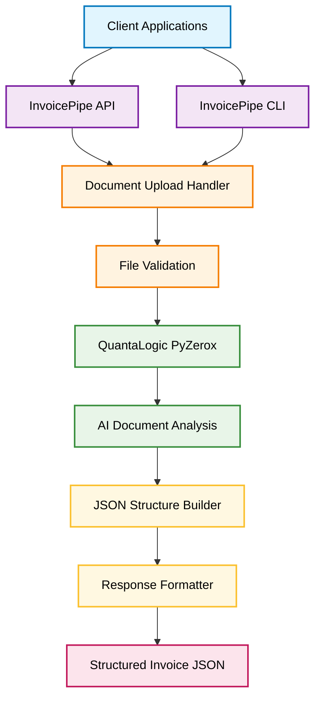
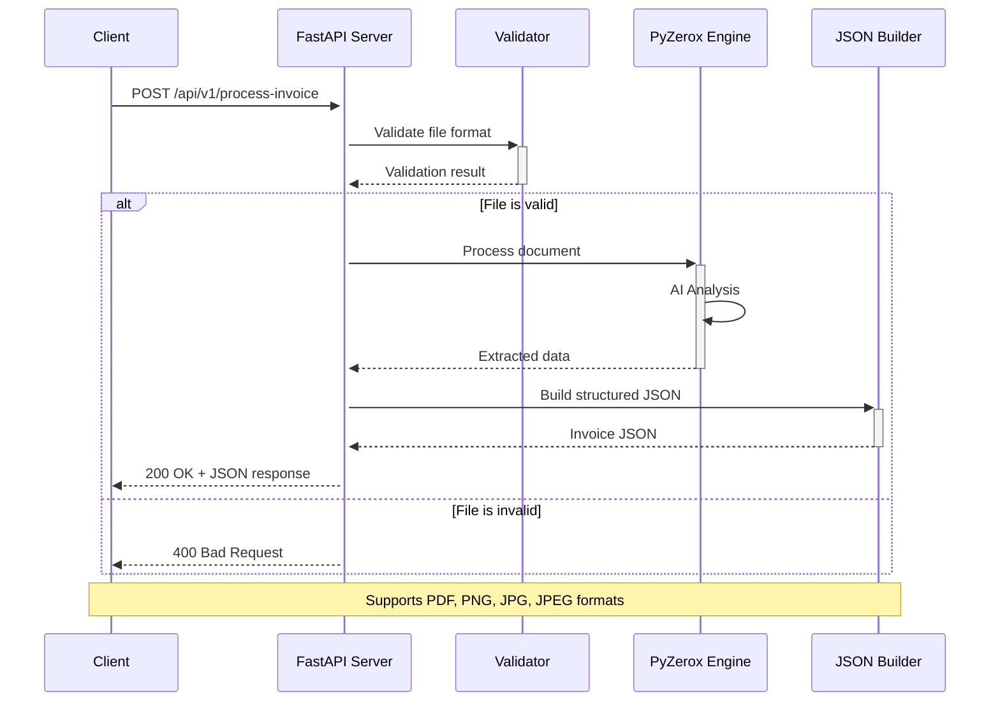
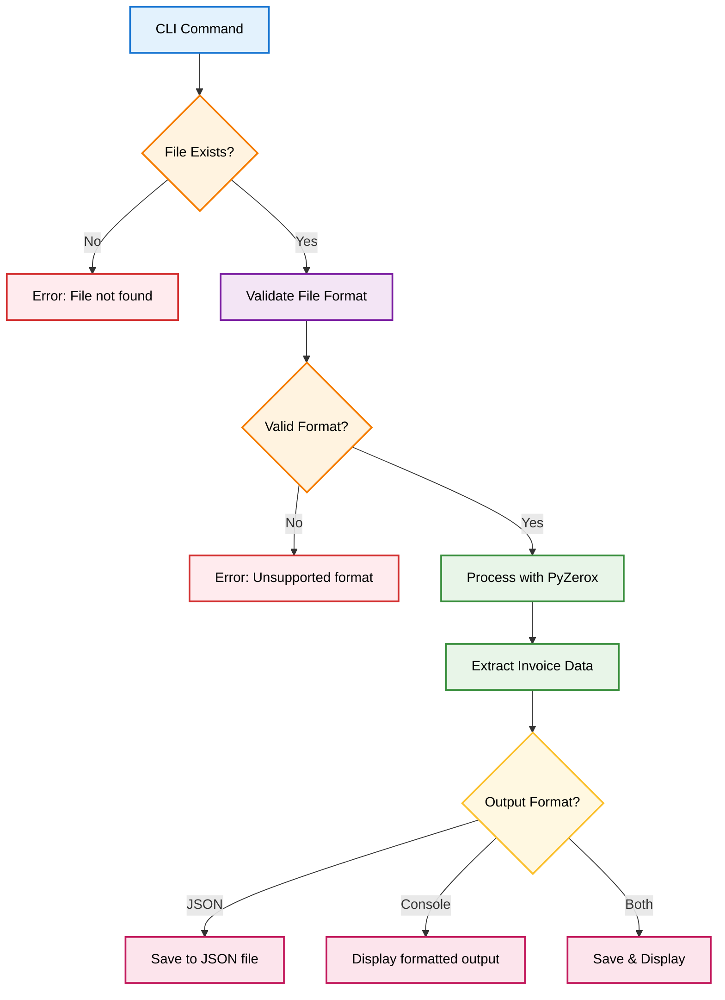
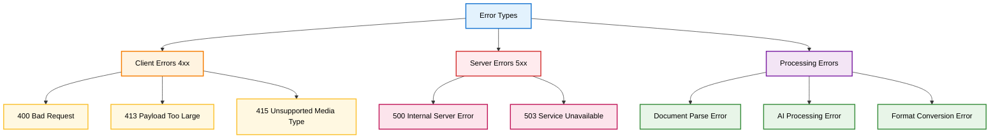
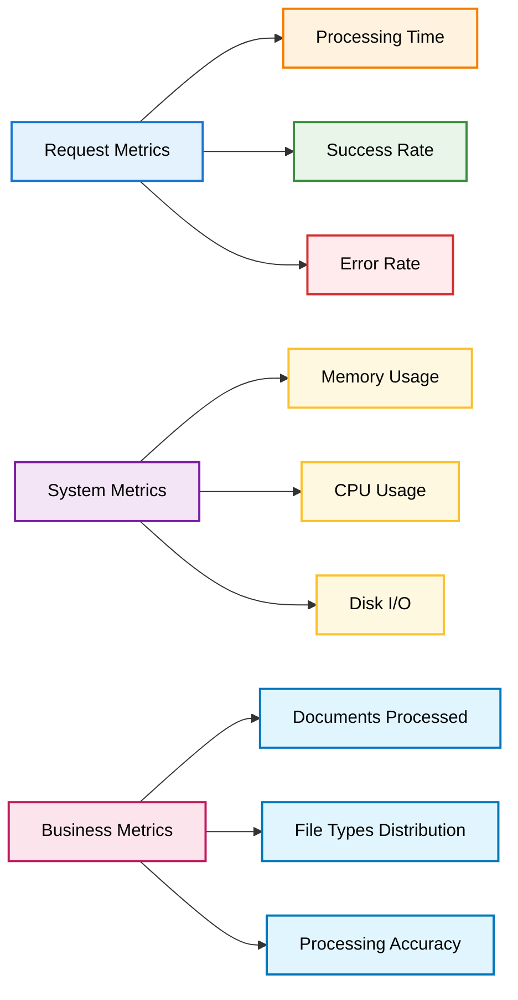

# InvoicePipe - Invoice Processing API & CLI Specification

## 1. Project Overview

InvoicePipe is a modern invoice processing solution that combines the power of FastAPI with advanced document analysis capabilities. The project extracts structured data from invoice documents (PDF, images) and provides both REST API and CLI interfaces for seamless integration.

> **Note:** InvoicePipe uses [QuantaLogic PyZerox](https://github.com/quantalogic/quantalogic-pyzerox) for AI-powered invoice analysis and extraction.

## 1.3 Libraries and Toolset

InvoicePipe leverages a robust set of modern Python libraries and tools to ensure reliability, maintainability, and developer productivity:

- **[FastAPI](https://fastapi.tiangolo.com/)**: High-performance web framework for building APIs with automatic OpenAPI documentation.
- **[QuantaLogic PyZerox](https://github.com/quantalogic/quantalogic-pyzerox)**: AI-powered library for extracting structured data from invoices and other documents.
- **[Pydantic](https://docs.pydantic.dev/)**: Data validation and settings management using Python type annotations.
- **[Click](https://click.palletsprojects.com/)**: Library for creating beautiful command line interfaces.
- **[Uvicorn](https://www.uvicorn.org/)**: Lightning-fast ASGI server for running FastAPI applications.
- **[Ruff](https://docs.astral.sh/ruff/)**: Extremely fast Python linter and code formatter.
- **[Hatchling](https://hatch.pypa.io/latest/build/)**: Modern, standards-based Python build backend.
- **[UV](https://github.com/astral-sh/uv)**: Next-generation Python package installer and resolver, compatible with PEP 621.
- **[Pytest](https://docs.pytest.org/)**: Powerful testing framework for Python.
- **[Sphinx](https://www.sphinx-doc.org/)**: Documentation generator for Python projects.
- **[Pillow](https://python-pillow.org/)**: Python Imaging Library for image file support.
- **[PyPDF2](https://pypdf2.readthedocs.io/)**: PDF file reading and manipulation.
- **[python-magic](https://github.com/ahupp/python-magic)**: File type identification using libmagic.

These libraries and tools are widely adopted in the Python ecosystem and are trusted for building production-grade applications. Each is referenced in the [pyproject.toml](#71-project-configuration-pyprojecttoml) and integrated into the development, testing, and deployment workflows of InvoicePipe.

### 1.1 Key Features

- **Multi-format Support**: Process PDF, PNG, JPG, and other image formats
- **AI-Powered Analysis**: Leverages QuantaLogic PyZerox for intelligent document parsing
- **Dual Interface**: Both REST API and CLI for maximum flexibility
- **Structured Output**: Returns standardized JSON with invoice details
- **Modern Architecture**: Built with FastAPI, UV, and modern Python tooling

### 1.2 Technology Stack

- **Backend**: FastAPI (Python 3.11+)
- **Document Processing**: [QuantaLogic PyZerox](https://github.com/quantalogic/quantalogic-pyzerox)
- **Project Management**: UV with PEP 621 style
- **Code Quality**: Ruff (linting & formatting)
- **Build System**: Hatchling
- **Testing**: Pytest
- **Documentation**: Sphinx
- **Deployment**: Docker support

## 2. System Architecture

### 2.1 High-Level Architecture



### 2.2 API Request Flow



### 2.3 CLI Workflow



## 3. API Specification

### 3.1 Base Configuration

- **Base URL**: `http://localhost:8000`
- **API Version**: `v1`
- **Content-Type**: `multipart/form-data` (for file uploads)
- **Response Format**: `application/json`

### 3.2 Endpoints

#### 3.2.1 Process Invoice Document

**Endpoint**: `POST /api/v1/process-invoice`

**Description**: Upload and process an invoice document to extract structured data.

**Request Parameters**:
- `file` (required): Invoice document file (PDF, PNG, JPG, JPEG)
- `options` (optional): JSON string with processing options

**Request Example**:
```bash
curl -X POST "http://localhost:8000/api/v1/process-invoice" \
  -F "file=@invoice.pdf" \
  -F "options={\"extract_line_items\": true, \"currency_detection\": true}"
```

**Response Schema**:
```json
{
  "success": true,
  "processing_time": 2.34,
  "invoice_data": {
    "invoice_number": "INV-2024-001",
    "date": "2024-07-07",
    "due_date": "2024-08-07",
    "vendor": {
      "name": "Acme Corp",
      "address": "123 Business St, City, State 12345",
      "tax_id": "12-3456789"
    },
    "customer": {
      "name": "Customer Corp",
      "address": "456 Customer Ave, City, State 67890"
    },
    "totals": {
      "subtotal": 1000.00,
      "tax": 100.00,
      "total": 1100.00,
      "currency": "USD"
    },
    "line_items": [
      {
        "description": "Professional Services",
        "quantity": 1,
        "unit_price": 1000.00,
        "total": 1000.00
      }
    ]
  }
}
```

**Error Responses**:
- `400 Bad Request`: Invalid file format or missing file
- `413 Payload Too Large`: File size exceeds limit
- `500 Internal Server Error`: Processing failure

#### 3.2.2 Health Check

**Endpoint**: `GET /api/v1/health`

**Response**:
```json
{
  "status": "healthy",
  "version": "1.0.0",
  "timestamp": "2024-07-07T12:00:00Z"
}
```

#### 3.2.3 API Information

**Endpoint**: `GET /api/v1/info`

**Response**:
```json
{
  "name": "InvoicePipe API",
  "version": "1.0.0",
  "description": "AI-powered invoice processing API",
  "supported_formats": ["pdf", "png", "jpg", "jpeg"],
  "max_file_size": "10MB"
}
```

## 4. CLI Specification

### 4.1 Installation

```bash
# Using UV
uv pip install invoicepipe

# Direct installation
pip install invoicepipe
```

### 4.2 Commands

#### 4.2.1 Process Invoice

**Command**: `invoicepipe process`

**Usage**:
```bash
invoicepipe process [OPTIONS] FILE_PATH
```

**Options**:
- `--output, -o`: Output file path (default: stdout)
- `--format, -f`: Output format [json|yaml|csv] (default: json)
- `--verbose, -v`: Verbose output
- `--pretty, -p`: Pretty-print JSON output
- `--extract-line-items`: Extract detailed line items
- `--currency-detection`: Enable currency detection

**Examples**:
```bash
# Basic processing
invoicepipe process invoice.pdf

# Save to file with pretty formatting
invoicepipe process invoice.pdf -o result.json --pretty

# Verbose processing with line items
invoicepipe process invoice.pdf --verbose --extract-line-items

# CSV output
invoicepipe process invoice.pdf --format csv -o invoice_data.csv
```

#### 4.2.2 Batch Processing

**Command**: `invoicepipe batch`

**Usage**:
```bash
invoicepipe batch [OPTIONS] INPUT_DIR OUTPUT_DIR
```

**Options**:
- `--workers, -w`: Number of parallel workers (default: 4)
- `--format, -f`: Output format [json|yaml|csv] (default: json)
- `--recursive, -r`: Process subdirectories recursively
- `--skip-errors`: Continue processing on errors

**Example**:
```bash
invoicepipe batch ./invoices ./processed --workers 8 --format json
```

#### 4.2.3 Server Mode

**Command**: `invoicepipe serve`

**Usage**:
```bash
invoicepipe serve [OPTIONS]
```

**Options**:
- `--host`: Host address (default: 127.0.0.1)
- `--port`: Port number (default: 8000)
- `--reload`: Enable auto-reload for development
- `--workers`: Number of worker processes

**Example**:
```bash
invoicepipe serve --host 0.0.0.0 --port 8080 --workers 4
```

## 5. Data Models

### 5.1 Invoice Data Structure

```python
from pydantic import BaseModel
from typing import List, Optional
from datetime import date
from decimal import Decimal

class Address(BaseModel):
    street: Optional[str] = None
    city: Optional[str] = None
    state: Optional[str] = None
    zip_code: Optional[str] = None
    country: Optional[str] = None

class Entity(BaseModel):
    name: str
    address: Optional[Address] = None
    tax_id: Optional[str] = None
    email: Optional[str] = None
    phone: Optional[str] = None

class LineItem(BaseModel):
    description: str
    quantity: Optional[Decimal] = None
    unit_price: Optional[Decimal] = None
    total: Optional[Decimal] = None
    tax_rate: Optional[Decimal] = None

class Totals(BaseModel):
    subtotal: Optional[Decimal] = None
    tax: Optional[Decimal] = None
    total: Decimal
    currency: str = "USD"

class InvoiceData(BaseModel):
    invoice_number: Optional[str] = None
    date: Optional[date] = None
    due_date: Optional[date] = None
    vendor: Optional[Entity] = None
    customer: Optional[Entity] = None
    totals: Totals
    line_items: List[LineItem] = []
    notes: Optional[str] = None
    payment_terms: Optional[str] = None
```

### 5.2 API Response Models

```python
class ProcessingResponse(BaseModel):
    success: bool
    processing_time: float
    invoice_data: InvoiceData
    confidence_score: Optional[float] = None
    warnings: List[str] = []

class ErrorResponse(BaseModel):
    success: bool = False
    error_code: str
    error_message: str
    details: Optional[dict] = None
```

## 6. Project Structure

```
invoicepipe/
├── src/
│   └── invoicepipe/
│       ├── __init__.py
│       ├── api/
│       │   ├── __init__.py
│       │   ├── main.py
│       │   ├── routes/
│       │   │   ├── __init__.py
│       │   │   └── invoice.py
│       │   └── middleware/
│       │       ├── __init__.py
│       │       └── error_handler.py
│       ├── cli/
│       │   ├── __init__.py
│       │   ├── main.py
│       │   └── commands/
│       │       ├── __init__.py
│       │       ├── process.py
│       │       ├── batch.py
│       │       └── serve.py
│       ├── core/
│       │   ├── __init__.py
│       │   ├── processor.py
│       │   ├── validators.py
│       │   └── config.py
│       ├── models/
│       │   ├── __init__.py
│       │   ├── invoice.py
│       │   └── response.py
│       └── utils/
│           ├── __init__.py
│           ├── file_handler.py
│           └── json_formatter.py
├── tests/
│   ├── __init__.py
│   ├── test_api.py
│   ├── test_cli.py
│   ├── test_processor.py
│   └── fixtures/
│       ├── sample_invoice.pdf
│       └── sample_invoice.png
├── docs/
│   ├── source/
│   │   ├── conf.py
│   │   ├── index.rst
│   │   ├── api.rst
│   │   └── cli.rst
│   └── spec-invoice.md
├── pyproject.toml
├── README.md
├── LICENSE
└── .gitignore
```

## 7. Development Setup

### 7.1 Project Configuration (pyproject.toml)

```toml
[build-system]
requires = ["hatchling"]
build-backend = "hatchling.build"

[project]
name = "invoicepipe"
dynamic = ["version"]
description = "AI-powered invoice processing API and CLI"
readme = "README.md"
license = {text = "MIT"}
authors = [
    {name = "Your Name", email = "your.email@example.com"},
]
classifiers = [
    "Development Status :: 4 - Beta",
    "Intended Audience :: Developers",
    "License :: OSI Approved :: MIT License",
    "Programming Language :: Python :: 3",
    "Programming Language :: Python :: 3.11",
    "Programming Language :: Python :: 3.12",
]
requires-python = ">=3.11"
dependencies = [
    "fastapi>=0.104.0",
    "uvicorn[standard]>=0.24.0",
    "pydantic>=2.5.0",
    "python-multipart>=0.0.6",
    "click>=8.1.0",
    "quantalogic-pyzerox>=0.1.0",
    "python-magic>=0.4.27",
    "Pillow>=10.0.0",
    "PyPDF2>=3.0.0",
]

[project.optional-dependencies]
dev = [
    "pytest>=7.4.0",
    "pytest-asyncio>=0.21.0",
    "httpx>=0.25.0",
    "ruff>=0.1.0",
    "sphinx>=7.0.0",
    "sphinx-rtd-theme>=1.3.0",
]

[project.urls]
Homepage = "https://github.com/yourusername/invoicepipe"
Documentation = "https://invoicepipe.readthedocs.io"
Repository = "https://github.com/yourusername/invoicepipe"
Issues = "https://github.com/yourusername/invoicepipe/issues"

[project.scripts]
invoicepipe = "invoicepipe.cli.main:main"

[tool.hatch.version]
path = "src/invoicepipe/__init__.py"

[tool.ruff]
line-length = 88
target-version = "py311"
select = [
    "E",  # pycodestyle errors
    "W",  # pycodestyle warnings
    "F",  # pyflakes
    "I",  # isort
    "B",  # flake8-bugbear
    "C4", # flake8-comprehensions
    "UP", # pyupgrade
]
ignore = [
    "E501",  # line too long
    "B008",  # do not perform function calls in argument defaults
]

[tool.ruff.format]
quote-style = "double"
indent-style = "space"
skip-string-normalization = false

[tool.pytest.ini_options]
testpaths = ["tests"]
python_files = ["test_*.py"]
python_classes = ["Test*"]
python_functions = ["test_*"]
addopts = "-v --tb=short"
```

### 7.2 Development Commands

```bash
# Setup development environment
uv venv
source .venv/bin/activate  # macOS/Linux
uv pip install -e ".[dev]"

# Code formatting and linting
ruff check src/
ruff format src/

# Run tests
pytest

# Run tests with coverage
pytest --cov=invoicepipe --cov-report=html

# Build documentation
cd docs && make html

# Run development server
invoicepipe serve --reload

# Build package
uv build
```

## 8. Testing Strategy

### 8.1 Test Categories

- **Unit Tests**: Core processing logic, validators, utilities
- **Integration Tests**: API endpoints, CLI commands
- **End-to-End Tests**: Complete workflows with sample invoices
- **Performance Tests**: Processing speed and memory usage

### 8.2 Test Fixtures

```python
# tests/fixtures/sample_data.py
import pytest
from pathlib import Path

@pytest.fixture
def sample_pdf_invoice():
    return Path(__file__).parent / "sample_invoice.pdf"

@pytest.fixture
def sample_png_invoice():
    return Path(__file__).parent / "sample_invoice.png"

@pytest.fixture
def expected_invoice_data():
    return {
        "invoice_number": "INV-2024-001",
        "date": "2024-07-07",
        "vendor": {"name": "Test Vendor"},
        "totals": {"total": 1100.00, "currency": "USD"}
    }
```

## 9. Deployment

### 9.1 Docker Configuration

```dockerfile
FROM python:3.11-slim

WORKDIR /app

COPY pyproject.toml ./
RUN pip install uv && uv pip install --system .

COPY src/ ./src/

EXPOSE 8000

CMD ["invoicepipe", "serve", "--host", "0.0.0.0", "--port", "8000"]
```

### 9.2 Production Considerations

- **Environment Variables**: Configure API keys, database URLs
- **Logging**: Structured logging with correlation IDs
- **Monitoring**: Health checks, metrics collection
- **Security**: Input validation, rate limiting, HTTPS
- **Scalability**: Horizontal scaling with load balancers

## 10. Performance Requirements

### 10.1 Processing Performance

- **Small Files** (< 1MB): Process within 2 seconds
- **Medium Files** (1-5MB): Process within 10 seconds
- **Large Files** (5-10MB): Process within 30 seconds
- **Concurrent Requests**: Support 100+ concurrent API requests

### 10.2 Resource Limits

- **Memory Usage**: < 512MB per worker process
- **CPU Usage**: Efficient multi-core utilization
- **Storage**: Temporary file cleanup after processing
- **Network**: Optimized for cloud deployment

## 11. Error Handling

### 11.1 Error Categories



### 11.2 Error Response Format

```json
{
  "success": false,
  "error_code": "INVALID_FILE_FORMAT",
  "error_message": "The uploaded file format is not supported",
  "details": {
    "supported_formats": ["pdf", "png", "jpg", "jpeg"],
    "received_format": "docx"
  },
  "timestamp": "2024-07-07T12:00:00Z",
  "request_id": "req-12345"
}
```

## 12. Security Considerations

### 12.1 Input Validation

- **File Type Validation**: Strict MIME type checking
- **File Size Limits**: Configurable maximum file sizes
- **Malware Scanning**: Optional virus scanning integration
- **Content Validation**: PDF structure validation

### 12.2 API Security

- **Rate Limiting**: Per-IP and per-user limits
- **Authentication**: Optional API key authentication
- **CORS**: Configurable cross-origin policies
- **Input Sanitization**: Prevent injection attacks

## 13. Monitoring and Observability

### 13.1 Metrics Collection



### 13.2 Logging Strategy

- **Structured Logging**: JSON format with consistent fields
- **Correlation IDs**: Track requests across services
- **Log Levels**: DEBUG, INFO, WARNING, ERROR, CRITICAL
- **Sensitive Data**: Redact PII and sensitive information

## 14. Future Enhancements

### 14.1 Planned Features

- **Multi-language Support**: OCR for various languages
- **Template Learning**: Vendor-specific invoice templates
- **Batch Processing**: Async processing for large volumes
- **Webhook Integration**: Real-time notifications
- **Database Storage**: Optional result persistence

### 14.2 Integration Possibilities

- **ERP Systems**: SAP, Oracle, NetSuite integration
- **Cloud Storage**: AWS S3, Google Cloud Storage
- **Email Processing**: Direct email attachment processing
- **Mobile SDK**: React Native and Flutter support

## 15. Conclusion

InvoicePipe provides a comprehensive solution for invoice processing with modern architecture, robust error handling, and flexible deployment options. The combination of FastAPI for web services and a full-featured CLI ensures maximum utility for both developers and end-users.

The project follows modern Python best practices with UV for dependency management, Ruff for code quality, and comprehensive testing with Pytest. The modular architecture allows for easy extension and customization while maintaining clean separation of concerns.

---

## Related Documentation

- [InvoicePipe Project Overview](../README.md)
- [Using QuantaLogic PyZerox to Analyze PDFs and Images](using-quantalogic-pyzerox.md)
- [Setting Up a FastAPI Project with Modern Python Tooling](setup-fastapi-project.md)
- [Managing Environment Variables and Configuration](managing-env-files.md)

## Learning Path

- [Step-by-Step Assignment: Building a Simple Invoice CLI Tool](preparation-work/step-by-step-assignment.md) - Perfect for getting started with a simpler version

*This specification document serves as the foundation for the InvoicePipe project development. It should be updated as the project evolves and new requirements emerge.*
