# {{cookiecutter.project_name}}

[](https://www.python.org/downloads/)
[](https://github.com/google/agent-development-kit)
[](#-quick-start)
[](https://docs.astral.sh/uv/)
[](https://hatch.pypa.io/latest/)

> **{{cookiecutter.description}}**

## 👉 Prerequisites

Before you begin, ensure you have:

- **Python {{cookiecutter.python_version}}+** installed on your system
- **[uv](https://docs.astral.sh/uv/)** - Modern Python package manager (recommended)
- **Git** for version control
- **Google Cloud Project** configured with Vertex AI enabled

### Installing uv

```bash
# macOS/Linux
curl -LsSf https://astral.sh/uv/install.sh | sh

# Windows
powershell -c "irm https://astral.sh/uv/install.ps1 | iex"

# Or use pip
pip install uv
```

## 🚀 Quick Start

### 1. Clone and Setup

```bash
# Clone the repository
git clone https://github.com/{{cookiecutter.author_email.split('@')[0]}}/{{cookiecutter.project_slug}}.git
cd {{cookiecutter.project_slug}}

# Set up development environment (creates venv, installs deps, configures pre-commit)
make dev-setup
```

### 2. Configure Environment

```bash
# Copy environment template
cp .env.example .env

# Edit .env file and add your configuration:
# - PROJECT_ID: Your Google Cloud project ID
# - LOCATION: Your preferred region (e.g., us-central1, europe-west1)
```

**Example `.env` configuration:**

```env
# Google Cloud Configuration (Required for Vertex AI)
PROJECT_ID=my-{{cookiecutter.project_slug}}-project
LOCATION=us-central1

# Application Settings
APP_NAME={{cookiecutter.package_name}}
DEBUG=false
LOG_LEVEL=INFO
```

### 3. Authenticate with Google Cloud (REQUIRED)

Before running the agent, you must authenticate with Google Cloud:

- **Development (Recommended):**
  ```bash
  gcloud auth application-default login
  gcloud config set project YOUR_PROJECT_ID
  ```
- **Production:**
  ```bash
  export GOOGLE_APPLICATION_CREDENTIALS="/path/to/your-service-account-key.json"
  ```

### 4. Run the Agent

```bash
# Start your AI agent
make run
```

## 🤖 What This Agent Does

**Core Capability**: {{cookiecutter.description}}

## 🏗️ Agent Architecture

```mermaid
graph TB
    subgraph "🤖 Agent Core"
        A[Natural Language Input]
        B[Intent Recognition]
        C[Response Generation]
    end

    subgraph "🛠️ Tools"
        D[Custom Tools]
        E[Validation]
        F[Error Handling]
    end

    subgraph "🌐 External Services"
        G[External APIs]
        H[Fallback Services]
    end

    A -->|Parse Query| B
    B -->|Select Tool| D
    D -->|API Call| G
    G -.->|API Error| H
    D -->|Validate| E
    E -->|Format| C
    C -->|Response| A

    F -.->|Backup| H
```



## 🛠️ Development Workflow

**Quick Start for Developers:**

```bash
make dev-setup    # Complete setup (2min)
make check        # Quick validation (30sec)
make run          # Start your agent (5sec)
make fix          # Auto-fix issues (10sec)
make ci           # Full CI pipeline (3min)
```

> **Note:** Documentation dependencies are installed automatically with `make dev-setup` or `make install`. If you see an error about `sphinx-build` missing, ensure you have run one of these commands first.

📖 **[Complete Development Workflow Guide](docs/development-workflow.md)** - Comprehensive guide covering daily development cycles, all available commands, quality standards, debugging, and release workflows.

## 📚 Documentation

**Quick Documentation Commands:**

```bash
make docs         # Build documentation
make docs-serve   # Serve docs locally (http://localhost:8000)
```

📖 **[Complete Documentation Guide](docs/documentation-guide.md)** - Comprehensive guide covering Sphinx setup, writing standards, API documentation generation, and publishing workflows.

## 📦 Package Management

**Quick Package Commands:**

```bash
uv sync              # Install all dependencies
uv add requests      # Add new dependency
uv add --dev pytest  # Add dev dependency
uv sync --upgrade    # Update dependencies
uv run python        # Run in project environment
```

📖 **[Complete Package Management Guide](docs/package-management-guide.md)** - Comprehensive guide covering uv usage, dependency management, project configuration, Poetry migration, and advanced features.

## 🧪 Testing Your Agent

### Test Categories

**Unit Tests** - Test individual components:

```bash
make test          # Run all tests
```

**Coverage Testing** - Validate test coverage:

```bash
make test-cov      # Tests with coverage report
```

**Watch Mode** - Continuous testing during development:

```bash
make test-watch    # Re-run tests on file changes
```

### Coverage & Quality

```bash
make test-cov          # Tests with coverage report
make quality           # All quality checks
make benchmark         # Performance testing
```

## 🎯 Extending the Agent

### Adding New Capabilities

1. **Create New Tools** (`{{cookiecutter.package_name}}/tools.py`):

```python
def custom_tool(input_data: str) -> str:
    """Your custom tool implementation."""
    # Your tool logic here
    return result
```

1. **Register Tools** with the agent:

```python
# In agent.py
root_agent = Agent(
    name="{{cookiecutter.package_name}}_agent",
    model="gemini-2.5-flash",
    description="{{cookiecutter.description}}",
    tools=[custom_tool],  # Add your tools here
)
```

1. **Test New Functionality**:

```python
def test_custom_tool():
    # Test your new tool with the actual agent
    result = custom_tool("test input")
    assert result is not None
```

## 🔧 Configuration

### Environment Setup

1. **Copy environment template**:

```bash
cp .env.example .env
```

1. **Configure Google Cloud settings** (required):

```env
PROJECT_ID=your-google-cloud-project-id
LOCATION=us-central1
```

### Configuration Options

| Setting      | Required | Description                              |
| ------------ | -------- | ---------------------------------------- |
| `PROJECT_ID` | ✅ Yes   | Your Google Cloud project ID             |
| `LOCATION`   | ✅ Yes   | Google Cloud region (e.g., us-central1)  |
| `DEBUG`      | ❌ No    | Enhanced logging for development         |
| `LOG_LEVEL`  | ❌ No    | Logging verbosity (INFO, DEBUG, WARNING) |

## 🚦 Troubleshooting

### Google Cloud Authentication Issues

**Problem**: "Could not automatically determine credentials" or "API keys are not supported by this API"

```bash
# Solution 1: User authentication (development)
gcloud auth application-default login
gcloud config set project YOUR_PROJECT_ID

# Solution 2: Service account authentication (production)
export GOOGLE_APPLICATION_CREDENTIALS="/path/to/service-account-key.json"
```

**Problem**: "Vertex AI API not enabled"

```bash
# Solution: Enable the API
gcloud services enable aiplatform.googleapis.com
```

### Quick Fixes

**Environment Issues:**

```bash
make clean-all && make dev-setup  # Reset everything
uv sync --reinstall              # Reinstall all dependencies
```

**Permission Problems:**

```bash
chmod +x .venv/bin/*              # Fix permissions
```

**Dependency Conflicts:**

```bash
make reset                        # Complete rebuild
uv sync --upgrade                 # Update all dependencies
```

### Common Issues

| Problem           | Solution            | Command                                            |
| ----------------- | ------------------- | -------------------------------------------------- |
| Network issues    | Check connectivity  | `make status`                                      |
| Dependencies      | Reset environment   | `make clean-all && make dev-setup`                 |
| Tests failing     | Check environment   | `make check`                                       |
| Auth errors       | Re-authenticate     | `gcloud auth application-default login`            |
| uv not found      | Install uv          | `curl -LsSf https://astral.sh/uv/install.sh \| sh` |
| Package conflicts | Clean and reinstall | `uv sync --reinstall`                              |
| Build errors      | Check dependencies  | `uv sync --dry-run`                                |

### Health Check

```bash
make status                       # Project health overview
uv --version                      # Check uv installation
uv sync --dry-run                 # Verify dependencies
gcloud auth list                  # Check authentication status
gcloud config list                # Verify project settings
```

## 🤝 Contributing

1. **Fork & Clone**: Get your own copy
2. **Setup**: `make dev-setup`
3. **Develop**: Use `make check` frequently
4. **Quality**: Run `make ci` before pushing
5. **Submit**: Create a pull request

### Code Standards

- **Type Safety**: Full type annotations required
- **Testing**: Maintain 95%+ coverage
- **Documentation**: Clear docstrings for all functions
- **Quality**: All `make ci` checks must pass

## 📚 Learn More

### Documentation

- **📖 Complete Documentation**: Run `make docs-serve` to view locally
- **🏗️ Architecture Guide**: [docs/architecture.rst](docs/architecture.rst)
- **🚀 Quickstart Guide**: [docs/quickstart.rst](docs/quickstart.rst)
- **🤝 Contributing Guide**: [docs/contributing.rst](docs/contributing.rst)
- **🔧 API Reference**: Auto-generated from code docstrings

### Project Resources

- **Google ADK Documentation**: [Agent Development Kit](https://github.com/google/agent-development-kit)
- **uv Documentation**: [Modern Python Package Management](https://docs.astral.sh/uv/)
- **Sphinx Documentation**: [Documentation Generator](https://www.sphinx-doc.org/)
- **PEP 621**: [Python Project Metadata Standard](https://peps.python.org/pep-0621/)

---

**Ready to build intelligent agents?** Start with `make dev-setup && make run` and begin experimenting!

_Built with ❤️ using Google ADK and modern Python development practices._

## 🔒 Security Considerations

### Production Authentication

For production deployments, **always use service accounts** instead of user authentication:

- ✅ **Service accounts** provide secure, scalable authentication for applications
- ✅ **JSON keys** can be rotated and managed independently
- ✅ **IAM permissions** can be fine-tuned for specific use cases
- ❌ **User authentication** is not suitable for production or CI/CD

### Key Management Best Practices

- 🔐 **Never commit** service account keys to version control
- 🔄 **Rotate keys** regularly (every 90 days recommended)
- 📁 **Store keys securely** with proper file permissions (600)
- 🏢 **Use Secret Manager** for containerized deployments
- 📊 **Monitor key usage** with Cloud Audit Logs
